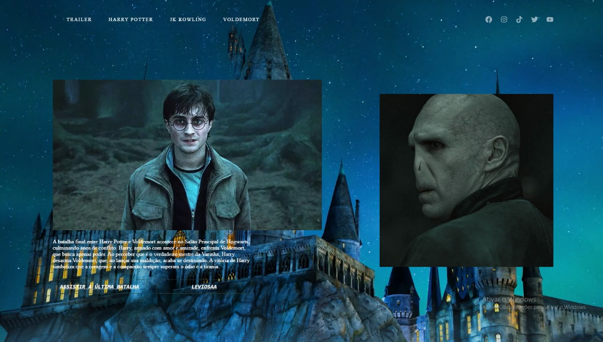

<h1 align="center">Harry Potter x Voldemort - David </h1>

---

## 💻 Sobre

Projeto feito no intuito de mostrar minha evolução e aprimorar meus conhecimentos.

## 🤯 O site é composto por:

- **Sessão de Wikpedia:** Informações sobre os personagens e a autora do filme;
- **Botões:** Para entrar no espírito de batalha, coloquei dois botões: Um com a luta final entre os dois, o outro com a wikpedia do último filme;
- **Imagens:** Imagens do Harry e do Voldemort, além de um fundo animado do castelo de Hogwarts;
- **Redes:** Minhas redes sociais disponíveis no menu de navegação e no header do site.

## 🧠 Tecnologias utilizadas:

O site **ainda está em desenvolvimento**, pois estou em constante aprendizado. Mas até aqui utilizei as tecnologias:

    
    
    

## 📚 Alguns conceitos aplicados

Neste projeto apliquei os seguintes pontos:
+ Semântica HTML;
+ Pontos de acessibilidade;

---
<table>
  <tr>
    <td>
      
    </td>
    <td>
      Feito por <a href="https://github.com/David-Dev18">David Nathan.</a>
    </td>
  </tr>
</table>
